# Overview
The Materials Markup Language (MatML) is an XML standard which serves to standardize the exchange of materials information. It is primarily used in the materials science, engineering, materials manufacturing, and related fields. 

Like any other XML schema, the MatML format provides a set of XML tags, attributes, and other elements along with their definitions and rules in how they may be organized. This schema, of course, is designed to store and exchange communicate information about materials, such as their composition, property data, manufacturing method, test results, shape and size, and much more. As such, there exist tags like `<Material>`, `<PropertyData>`, `<Specification>`, amongst many others.

The MatML schema has been employed in several software packages including Siemens NX, GRANTA, and others. A few free software programs exist which enable editing and using MatML data such as those listed [here](https://github.com/nogula/elematic/wiki#see-also) on the wiki's home page, and now with [elematic](https://github.com/nogula/elematic).

Numerous literature have been published on the history, development, and application of the MatML schema, some of which is provided in [References & Further Reading](https://github.com/nogula/elematic/wiki/The-MatML-Schema#references--further-reading).

# MatML for the User

The MatML schema has a straightforward architecture when viewed from afar. Simply, every MatML file has a top-most element called `MatML_Doc` which contains at least one `Material` (or possibly more), and optionally, `Metadata`.

The `Material` element contains information about the material, such as property data, attributes, etc. Those property data are contained in either `BulkDetails` (which may occur once or not at all), or `ComponentDetails` (which may occur any number of times). The difference between these is that `ComponentDetails` is appropriate for a particular layer, phase, or some other sub-component of a material, whereas naturally, `BulkDetails` describes the material overall. So for instance, the material card for a carbon fiber reinforced polymer may have a `BulkDetails` which defines the `Name` of the overall material, but there are subsequent `ComponentDetails` for each of the fiber and matrix components.

```mermaid
graph LR
    MatML_Doc[`MatML_Doc`\nTop-Most Element]
    Material[`Material`\nContains property information]
    Metadata[`Metadata`\nContains property definitions]
    BulkDetails[`BulkDetails`\nContains bulk information]
    ComponentDetails[`ComponentDetails`\nContains component information]
    
    MatML_Doc -->|at least one| Material
    MatML_Doc -->|at most one| Metadata
    Material -->|at most one| BulkDetails
    Material -->|any number| ComponentDetails
```


The `Metadata` contains the definitions of property data and other elements within the `Material` elements.

Looking more closely at the `BulkDetails` element, it comprises ten child elements, spanning description information (like specification and form), as well as property data such as the processing details and actual `PropertyData`. Each of these elements, in turn, have additional child elements. For instance, the `PropertyData` element has seven attributes and five child elements.


The attributes refer to definitions found in the `Metadata`. For instance there is a `PropertyDetails` element which has a certain `id`. The `property` attribute of a `PropertyData` element corresponds to that of the `PropertyDetails`'s `id`.


<details>
<summary>Example MatML File - Aluminum Alloy from a Printed Handbook</summary>

```xml
<!--
******************************************************************************************************************************
	MatML Version 3.0 Schema Example 2 - Aluminum Alloy from a Printed Handbook
	Prepared by - E.F. Begley, NIST and J.G. Kaufman, The Aluminum Association, Inc.
	Source - Handbook data generously provided by F. Cverna of ASM International and J.G. Kaufman of the 
	Aluminum Association from Properties of Aluminum Alloys, p. 291, ASM International, Materials Park, Ohio, 
	ISBN: 0-87170-632-6, 1999.

	Modified 16 July 2004 by Craig Seymour, Granta Design to match MatML Version 3.1
	******************************************************************************************************************************	
-->
<MatML_Doc xsi:noNamespaceSchemaLocation="matml31.xsd">
	<Material>
		<BulkDetails>
			<Name authority="AAADS">1350</Name>
			<Class>
				<Name>metal</Name>
			</Class>
			<Subclass>
				<Name>aluminum alloy</Name>
			</Subclass>
			<Specification>ASTM B230</Specification>
			<Form>
				<Description>Rolled rod and shapes</Description>
			</Form>
			<ProcessingDetails>
				<Name>Temper H18</Name>
			</ProcessingDetails>
			<Characterization>
				<Formula>Al</Formula>
				<DimensionalDetails>
					<Name>Thickness</Name>
					<Value format="string">0.5,2.0</Value>
					<Units name="inches">
						<Unit>
							<Name>in</Name>
						</Unit>
					</Units>
					<Qualifier>min.,max.</Qualifier>
				</DimensionalDetails>
			</Characterization>
			<PropertyData property="pr1" technique="mt1" source="ds1" specimen="sp1">
				<Data format="float">+23,+17,+15,+14.5,+14.5</Data>
				<ParameterValue parameter="pa1" format="integer">
					<Data>0,0,0,0,0</Data>
				</ParameterValue>
				<ParameterValue parameter="pa2" format="integer">
					<Data>1,1,1,1,1</Data>
				</ParameterValue>
				<ParameterValue parameter="pa3" format="exponential">
					<Data>1.0E5,1.0E6,1.0E7,1.0E8,5.0E8</Data>
				</ParameterValue>
			</PropertyData>
			<PropertyData property="pr2" technique="mt1" source="ds1" specimen="sp1">
				<Data format="integer">+160,+115,+105,+100,+100</Data>
				<ParameterValue parameter="pa1" format="integer">
					<Data>0,0,0,0,0</Data>
				</ParameterValue>
				<ParameterValue parameter="pa2" format="integer">
					<Data>1,1,1,1,1</Data>
				</ParameterValue>
				<ParameterValue parameter="pa3" format="exponential">
					<Data>1.0E5,1.0E6,1.0E7,1.0E8,5.0E8</Data>
				</ParameterValue>
			</PropertyData>
			<PropertyData property="pr1" technique="mt1" source="ds1" specimen="sp1">
				<Data format="float">+11.5,+8.5,+7,+6.5,+6.5</Data>
				<ParameterValue parameter="pa1" format="integer">
					<Data>-1,-1,-1,-1,-1</Data>
				</ParameterValue>
				<ParameterValue parameter="pa2" format="integer">
					<Data>1,1,1,1,1</Data>
				</ParameterValue>
				<ParameterValue parameter="pa3" format="exponential">
					<Data>1.0E5,1.0E6,1.0E7,1.0E8,5.0E8</Data>
				</ParameterValue>
			</PropertyData>
			<PropertyData property="pr2" technique="mt1" source="ds1" specimen="sp1">
				<Data format="integer">+80,+59,+48,+45,+45</Data>
				<ParameterValue parameter="pa1" format="integer">
					<Data>-1,-1,-1,-1,-1</Data>
				</ParameterValue>
				<ParameterValue parameter="pa2" format="integer">
					<Data>1,1,1,1,1</Data>
				</ParameterValue>
				<ParameterValue parameter="pa3" format="exponential">
					<Data>1.0E5,1.0E6,1.0E7,1.0E8,5.0E8</Data>
				</ParameterValue>
			</PropertyData>
		</BulkDetails>
		<Glossary>
			<Term>
				<Name>H18</Name>
				<Definition>
					"H18" is a code from The Aluminum Association Temper Designation System. The H is defined as "strain-hardened (wrought products only). The 1 applies to products that are strain-hardened to obtain the desired strength without supplementary thermal treatment. The 8 indicates the degree of strain-hardening and is assigned to the hardest tempers normally produced.
				</Definition>
			</Term>
			<Term>
				<Name>1350</Name>
				<Definition>
					"1350" is a code from The Aluminum Association Alloy Designation System. The first digit of the code represents the principal alloying constitutent(s). The second digit indicates variations of the initial alloy. The third and fourth digits indicate individual alloy variations (the numbers have no significance but are unique). 1350 is an alloy that is pure AL (99.00% or greater). For further details, contact The Aluminum Association, 900 19th Street, N.W., Washington, D.C. 20006.
				</Definition>
			</Term>
		</Glossary>
	</Material>
	<Metadata>
		<AuthorityDetails id="AAADS">
			<Name>The Aluminum Association Alloy Designation System</Name>
		</AuthorityDetails>
		<DataSourceDetails id="ds1" type="handbook, typical data">
			<Name>
				"Properties of aluminum alloys : tensile, creep, and fatigue data at high and low temperatures" / edited by J. Gilbert Kaufman.
			</Name>
			<Notes>
				Plus (+) indicates tension; minus (-) indicates compression.
			</Notes>
		</DataSourceDetails>
		<MeasurementTechniqueDetails id="mt1">
			<Name>ASTM E597</Name>
		</MeasurementTechniqueDetails>
		<ParameterDetails id="pa1">
			<Name>Stress Ratio</Name>
			<Unitless/>
			<Notes>
				Stress Ratio (R) = (minimum stress)/(maximum stress)
			</Notes>
		</ParameterDetails>
		<ParameterDetails id="pa2">
			<Name>Number of Samples</Name>
			<Unitless/>
		</ParameterDetails>
		<ParameterDetails id="pa3">
			<Name>Number of Cycles</Name>
			<Unitless/>
		</ParameterDetails>
		<PropertyDetails id="pr1" type="mechanical">
			<Name>Axial-Stress Fatigue Strength</Name>
			<Units name="ksi" description="kip per square inch">
				<Unit>
					<Name>ksi</Name>
				</Unit>
			</Units>
		</PropertyDetails>
		<PropertyDetails id="pr2" type="mechanical">
			<Name>Axial-Stress Fatigue Strength</Name>
			<Units name="MPa" description="megapascals">
				<Unit>
					<Name>MPa</Name>
				</Unit>
			</Units>
		</PropertyDetails>
		<SpecimenDetails id="sp1" type="cylindrical">
			<Name>smooth specimen</Name>
			<Notes>diameter = 0.375 inches</Notes>
		</SpecimenDetails>
	</Metadata>
</MatML_Doc>
```
</details>

# References & Further Reading
- A. S. Varde, E. F. Begley, and S. Fahrenholz-Mann, ‘MatML: XML for information exchange with materials property data’, in Proceedings of the 4th International Workshop on Data Mining Standards, Services and Platforms, Philadelphia, Pennsylvania, 2006, pp. 47–54. [Online]. Available: https://web.cs.wpi.edu/~aparna/MatMLAESJuly14.pdf
- X. Zhang, C. Hu, and H. Li, “Semantic Query on Materials Data Based on Mapping MatML to an OWL Ontology,” Data Science Journal, vol. 8. Ubiquity Press, Ltd., pp. 1–17, 2009. doi: 10.2481/dsj.8.1. [Online]. Available: https://datascience.codata.org/articles/10.2481/dsj.8.1
- https://groups.oasis-open.org/higherlogic/ws/public/download/4629/Matml%203.0%20Schema.pdf